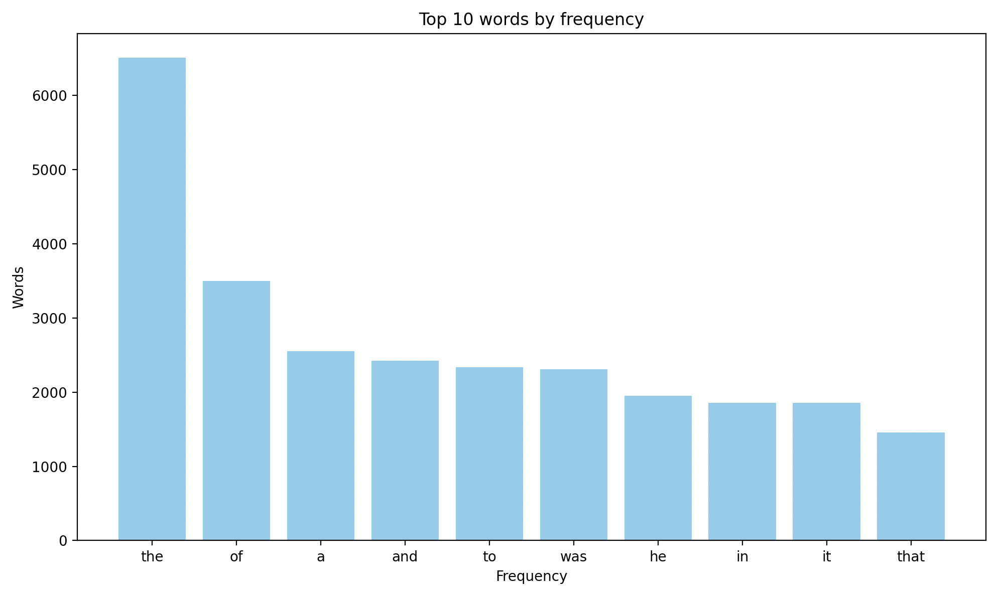

# goit-cs-hw-05

### Task 1

- `python -m venv .venv` or `python3 -m venv .venv` to create virtual environment
- `source .venv/bin/activate` to activate venv
- `pip3 install -r requirements.txt` install packages
- `python3 main.py --src={source_folder} --dist={destination_folder}` - to run main program

Example `python3 main.py --src=./.venv --dist=./dist`

### Task 2

- `python -m venv .venv` or `python3 -m venv .venv` to create virtual environment
- `source .venv/bin/activate` to activate venv
- `pip3 install -r requirements.txt` install packages
- `python3 main.py --url={source_url}` - to run main program

Example `python3 main.py --url=https://gutenberg.net.au/ebooks01/0100021.txt`

Result 

